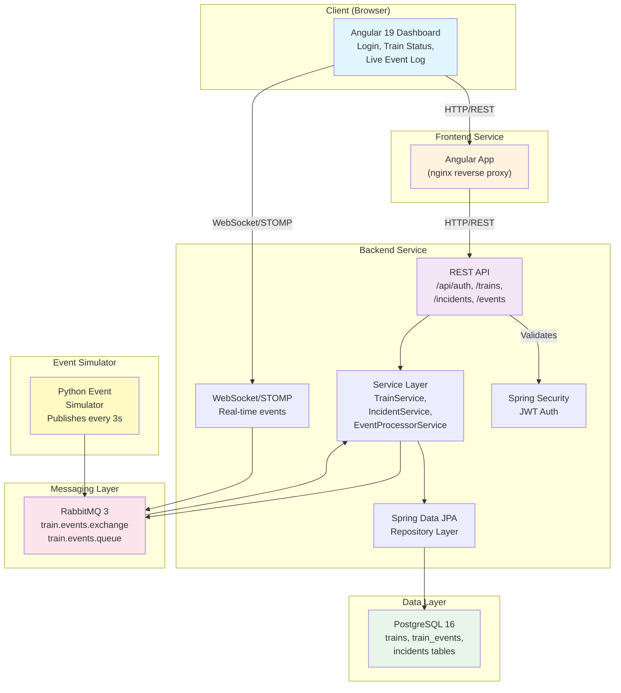

# New Hire Exploration Guide

## 0. What Is This Project?

**Rail Event Monitor** is an event-driven railroad operations monitoring system designed for real-time tracking of train status, incidents, and events. Operations teams use it to monitor train movements across routes, quickly identify incidents like delays or maintenance issues, and respond with coordinated updates. The system ingests live event streams from a Python simulator (and real telemetry sources), processes them through a message broker, stores normalized data in a relational database, and pushes real-time updates to a web-based dashboard via WebSocket. This is a full-stack demonstration of modern event-driven microservices: Java Spring Boot backend with JWT authentication, Angular 19 frontend dashboard, RabbitMQ message broker, PostgreSQL database, and automated CI/CD to cloud hosting.

---

## 1. Quick Start (Everything Up in One Command)

Start the entire stack locally with one command:

```bash
docker compose up --build
```

This command will:
1. Build the backend (Java/Spring Boot)
2. Build the frontend (Angular)
3. Build the Python simulator
4. Start PostgreSQL, RabbitMQ, and all services
5. Wait for health checks to pass
6. Be ready for you to explore in ~60 seconds

**Service Map**

| Service | URL | What You Will See |
|---|---|---|
| Frontend Dashboard | http://localhost:4200 | Login page with demo credentials |
| Backend API | http://localhost:18080 | Health check endpoint |
| Swagger UI (API Docs) | http://localhost:18080/swagger-ui.html | Interactive API documentation |
| RabbitMQ Management | http://localhost:15672 | Message broker dashboard with queues and exchanges |
| Database Admin (Adminer) | http://localhost:8888 | PostgreSQL web UI to browse tables and data |
| Component Explorer (Storybook) | http://localhost:6006 | Interactive component library (after frontend build) |
| Active Incidents API | http://localhost:18080/api/incidents/active | JSON list of open incidents |

---

## 2. Explore the Frontend

Once `docker compose up` completes, open **http://localhost:4200** in your browser.

### Landing Page & Login

You will see a login page. The frontend requires authentication to access the dashboard.

**Login with these demo credentials:**
- Username: `ops@railmonitor.local`
- Password: `demo1234`

### After Login — The Dashboard

You will be redirected to the **Rail Operations Dashboard** displaying:

1. **Topbar** — Displays "Rail Operations Dashboard" title and a "Log out" button

2. **Incident Banner** (top section) — Shows a red alert box if any incidents are OPEN. Click to see:
   - Incident severity level
   - Train code affected
   - Summary and details

3. **Train Status Table** — Lists all trains currently in the system:
   - **Code:** Train identifier (e.g., TR-1001)
   - **Route:** Starting point → destination (e.g., Jacksonville → Pittsburgh)
   - **Status:** Current state (ON_TIME, DELAYED, MAINTENANCE)
   
   *Note: These trains are pre-seeded in the database and will update as events are processed.*

4. **Live Event Log** — Real-time stream of incoming events:
   - Shows train code and event type (POSITION_UPDATE, STATUS_UPDATE, INCIDENT)
   - Displays status changes as they arrive via WebSocket
   - Timestamps on each event
   
   *The Python simulator publishes events every 3 seconds, so you will see this log update continuously.*

### Frontend Source Code Structure

Navigate your editor to `frontend/src/app/`:

| Directory | Purpose |
|---|---|
| `pages/` | Top-level routable components (`login.component.ts`, `dashboard.component.ts`) |
| `components/` | Reusable UI components (`incident-banner.component.ts`) |
| `services/` | API and WebSocket integration (`api.service.ts`, `auth.service.ts`, `event-websocket.service.ts`) |
| `core/` | Guards and interceptors (`auth.guard.ts`) |
| `types/` | TypeScript interfaces (`Incident`, `Train`, `TrainEvent`) |

### Component Framework

The frontend uses **Angular 19 standalone components** — each component is self-contained with its own imports (no NgModule). Example from `dashboard.component.ts`:

```typescript
@Component({
  selector: 'app-dashboard',
  standalone: true,
  imports: [NgFor, NgIf, DatePipe, IncidentBannerComponent],
  template: `...`
})
```

This approach reduces boilerplate and makes components more modular.

### Routing

Routes are defined in `frontend/src/app/app.routes.ts`:
- `/login` — Unauthenticated login page
- `/dashboard` — Protected dashboard (requires auth guard)
- `/` — Redirects to dashboard

The `authGuard` (in `frontend/src/app/core/auth.guard.ts`) checks for a valid JWT token in local storage before allowing access to the dashboard.

### Storybook Component Library

To view isolated component stories (UI components in isolation):

```bash
cd frontend
npm run storybook
```

Storybook will open at **http://localhost:6006**. You can:
- View the `LoginComponent` story to see different login states
- View the `IncidentBannerComponent` story to see how the incident alert is rendered with various data

---

## 3. Explore the Backend API

The backend exposes a REST API with interactive documentation.

### Swagger UI

Open **http://localhost:18080/swagger-ui.html** in your browser.

You will see a searchable list of all API endpoints, organized by resource:
- `/api/auth` — Authentication
- `/api/trains` — Train data
- `/api/events` — Event publishing
- `/api/incidents` — Incident management

### How to Authenticate

Most endpoints require a JWT token. To get a token:

1. In Swagger UI, find the **POST /api/auth/login** endpoint and click "Try it out"
2. Replace the request body with:
   ```json
   {
     "username": "ops@railmonitor.local",
     "password": "demo1234"
   }
   ```
3. Click **Execute**
4. Copy the `token` from the response
5. Click the **Authorize** button (top-right of Swagger UI)
6. Paste the token as: `Bearer <token>`
7. Click **Authorize** — now all endpoints are authenticated

### Key Endpoints to Try (In Order)

**1. Get Active Incidents** (read-only, safe to start here)
```
GET /api/incidents/active
```
- Returns a JSON array of currently open incidents
- See what the dashboard alerts are triggered by

**2. Get All Trains**
```
GET /api/trains
```
- Lists all trains in the system
- Shows train code, route, and current status

**3. Get Recent Events**
```
GET /api/events
```
- Returns the last N train events from the database
- Each event has timestamp, train code, event type, and payload

**4. Create an Incident** (write operation)
```
POST /api/incidents
```
- Create a new incident for testing
- Request body:
  ```json
  {
    "trainCode": "TR-1001",
    "severity": "HIGH",
    "summary": "Test incident from API",
    "details": "This is a test incident created via Swagger UI"
  }
  ```
- Response: HTTP 201 Created with the new incident object

**5. Publish an Event** (write operation)
```
POST /api/events
```
- Simulate publishing a new event to RabbitMQ
- Request body:
  ```json
  {
    "trainCode": "TR-1002",
    "eventType": "STATUS_UPDATE",
    "status": "DELAYED",
    "details": "Manual event from API test"
  }
  ```
- The backend will publish to RabbitMQ and the Python simulator will process it

**6. Get Train by ID** (read-only)
```
GET /api/trains/{id}
```
- Retrieve details for a specific train
- Try ID `1` (the first pre-seeded train)

**7. Health Check** (no auth required)
```
GET /actuator/health
```
- Returns `{"status":"UP"}` if the backend is healthy
- Useful for monitoring and deployment verification

### Backend Source Code Structure

Navigate to `backend/src/main/java/com/siemens/railmonitor/`:

| Directory | Purpose |
|---|---|
| `controller/` | REST endpoint handlers (`AuthController`, `IncidentController`, `TrainController`, `EventController`) |
| `service/` | Business logic (`IncidentService`, `TrainService`, `EventProcessorService`) |
| `domain/` | JPA entities (`Train`, `TrainEvent`, `Incident`) |
| `repository/` | Spring Data JPA repositories (data access layer) |
| `security/` | JWT utilities and auth filters (`JwtUtil`, `JwtAuthFilter`) |
| `config/` | Spring configuration beans (`SecurityConfig`, `RabbitMqConfig`, `WebSocketConfig`, `OpenApiConfig`) |
| `messaging/` | Message handling (`TrainEventListener` — RabbitMQ consumer) |

### Key Entry Point

**`RailEventMonitorApplication.java`** — Starts the Spring Boot application with OpenAPI/Swagger annotations.

---

## 4. Explore the Database

### Adminer Web UI

Open **http://localhost:8888** in your browser.

**Login credentials:**
- System: `PostgreSQL`
- Server: `db`
- Username: `postgres`
- Password: `postgres`
- Database: `rail_monitor`

Click **Login**.

### Main Tables

Once logged in, you can browse the `rail_monitor` database:

1. **`trains`** — Master list of trains
   ```
   id (BIGSERIAL) | train_code (VARCHAR) | route (VARCHAR) | status (VARCHAR)
   ```
   - Example row: `1 | TR-1001 | Jacksonville -> Pittsburgh | ON_TIME`
   - Pre-seeded with 3 demo trains (TR-1001, TR-1002, TR-1003)

2. **`train_events`** — Immutable log of all events
   ```
   id | train_code | event_type | payload | created_at
   ```
   - Example row: `1 | TR-1001 | POSITION_UPDATE | {"lat": 40.7, "lng": -74.0} | 2025-06-06 10:30:00+00`
   - Grows as the simulator publishes events
   - `event_type` can be: POSITION_UPDATE, STATUS_UPDATE, or INCIDENT

3. **`incidents`** — Operational incidents and alerts
   ```
   id | train_code | severity | summary | details | status | opened_at | resolved_at
   ```
   - Example row: `1 | TR-1001 | HIGH | Train delayed | Mechanical issue | OPEN | 2025-06-06 10:15:00+00 | NULL`
   - `status` can be: OPEN or RESOLVED
   - `severity` can be: LOW, MEDIUM, HIGH, CRITICAL
   - Indexed on `(status, opened_at DESC)` for fast queries of active incidents

### Example Query to Understand Data

In Adminer, click on the `trains` table and run this SQL:

```sql
SELECT 
  t.train_code,
  t.route,
  t.status,
  COUNT(e.id) as event_count,
  MAX(e.created_at) as last_event_time
FROM trains t
LEFT JOIN train_events e ON t.train_code = e.train_code
GROUP BY t.id, t.train_code, t.route, t.status
ORDER BY last_event_time DESC NULLS LAST;
```

This query shows:
- Each train
- How many events have been recorded for it
- When the most recent event occurred

### Database Migrations

Database schema is version-controlled via **Flyway** in `backend/src/main/resources/db/migration/`:

| File | Purpose |
|---|---|
| `V1__init.sql` | Creates `trains` and `train_events` tables |
| `V2__seed_data.sql` | Inserts the 3 demo trains (idempotent via `ON CONFLICT`) |
| `V3__incidents.sql` | Creates `incidents` table with performance index |

When the backend starts, Flyway automatically applies all pending migrations. You can check migration history in Adminer by looking at the `flyway_schema_history` table.

### Seed Data Location

The demo trains are loaded from `V2__seed_data.sql`:
```sql
INSERT INTO trains (train_code, route, status) VALUES
('TR-1001', 'Jacksonville -> Pittsburgh', 'ON_TIME'),
('TR-1002', 'Minnetonka -> Jacksonville', 'ON_TIME'),
('TR-1003', 'Pittsburgh -> Jacksonville', 'DELAYED');
```

---

## 5. Explore the CI/CD Pipeline

The CI/CD pipeline is defined in `.github/workflows/ci.yml` and runs on **GitHub Actions**.

### Pipeline Trigger

The pipeline runs automatically on:
- **Every pull request** to `main` branch — full test suite, but no deployment
- **Every push** to `main` branch — test + build + push to Docker Hub + deploy to staging

### Pipeline Stages

```
Trigger (push/PR to main)
  ↓
  ├─→ backend-test (Java 17, mvn test) ─┐
  │                                       ├→ docker-build (only if tests pass)
  ├─→ frontend-build (Node 20, npm run build) ─┤
  │                                             ├→ deploy-staging (only if push, not PR)
  └─────────────────────────────────────────────┘
```

### Job Details

#### **Job 1: backend-test**
- Runs on: `ubuntu-latest`
- Steps:
  1. Checkout code
  2. Set up Java 17
  3. Cache Maven dependencies (speeds up repeat runs)
  4. Run `mvn -B test` — executes unit and integration tests
- Pass/Fail: If tests fail, the entire pipeline stops

#### **Job 2: frontend-build**
- Runs on: `ubuntu-latest`
- Steps:
  1. Checkout code
  2. Set up Node 20
  3. Cache npm modules
  4. `npm ci` — clean install
  5. `npm run build` — build production Angular bundle
  6. `npm run build-storybook` — generate static Storybook site
- Pass/Fail: If build fails, docker-build is skipped

#### **Job 3: docker-build**
- **Depends on:** Both `backend-test` and `frontend-build` passing
- **Only runs on:** `push` to main (not on PRs)
- Steps:
  1. Checkout code
  2. Log in to Docker Hub (using secrets)
  3. Build and push backend image:
     - Tags: `username/rail-event-monitor-backend:latest` and `username/rail-event-monitor-backend:SHA`
  4. Build and push frontend image:
     - Tags: `username/rail-event-monitor-frontend:latest` and `username/rail-event-monitor-frontend:SHA`

#### **Job 4: deploy-staging**
- **Depends on:** `docker-build` passing
- **Only runs on:** `push` to main (not on PRs)
- Steps:
  1. Trigger Render deploy webhook:
     ```bash
     curl -f -X POST ${{ secrets.RENDER_STAGING_DEPLOY_HOOK }}
     ```
  2. Poll the backend health endpoint every 10 seconds for 3 minutes:
     ```bash
     curl -s -o /dev/null -w "%{http_code}" ${{ secrets.RENDER_BACKEND_URL }}/actuator/health
     ```
  3. If health check returns 200, deployment succeeded
  4. If timeout or non-200 response, deployment failed and pipeline exits with error

### How to Read a Pipeline Run

1. Go to **GitHub repo → Actions** tab
2. Click on the most recent workflow run
3. You will see:
   - Overall status (✅ success or ❌ failed)
   - Each job as a collapsible section
   - For each job, the steps with timing and logs
4. Click into a failing step to see the error output

### Required Secrets (Names Only)

These environment variables must be set in GitHub repository settings for the pipeline to work:

| Secret Name | Used By | Purpose |
|---|---|---|
| `DOCKERHUB_USERNAME` | docker-build | Docker Hub account username |
| `DOCKERHUB_TOKEN` | docker-build | Docker Hub personal access token |
| `RENDER_STAGING_DEPLOY_HOOK` | deploy-staging | Webhook URL to trigger Render deployment |
| `RENDER_BACKEND_URL` | deploy-staging | URL of staging backend (e.g., https://rail-backend-staging.onrender.com) |

*Note: Do not commit these secrets. They are stored encrypted in GitHub.*

### Manual Trigger (Optional)

If you need to re-run a failed pipeline:
1. Go to **Actions** tab
2. Click on the failed workflow run
3. Click **Re-run jobs** → **Re-run all jobs**

---

## 6. Explore Cloud Services

The Rail Event Monitor uses a **local RabbitMQ message broker** in Docker Compose, with no real cloud services (S3, SQS, Lambda, etc.) in the current implementation.

### RabbitMQ Message Broker

**Access:** http://localhost:15672

**Credentials:**
- Username: `guest`
- Password: `guest`

### What You Will See in RabbitMQ Management UI

#### **Connections**
- One connection per running service (backend, simulator, etc.)
- Shows connection state and message rate

#### **Channels**
- Each connection has one or more channels for publishing/consuming
- Displays prefetch settings and message acknowledgments

#### **Exchanges**
- **`train.events.exchange`** (direct exchange, durable)
  - Used to route events to the queue based on routing key
  - The Python simulator publishes here
  - The Spring backend's `@RabbitListener` subscribes here

#### **Queues**
- **`train.events.queue`** (durable, auto-ack disabled for safety)
  - Messages accumulate here if no consumer is available
  - Current depth shown as message count

### How Events Flow End-to-End

1. **Python Simulator** publishes a JSON message every 3 seconds:
   ```json
   {
     "trainCode": "TR-1001",
     "eventType": "STATUS_UPDATE",
     "status": "DELAYED",
     "details": "auto-generated event"
   }
   ```

2. **RabbitMQ** routes the message from exchange → queue

3. **Spring Backend** `TrainEventListener` consumes the message:
   - Deserializes JSON to `TrainEventMessage` DTO
   - Calls `EventProcessorService.processEvent()`
   - Updates database and broadcasts via WebSocket

4. **Frontend Dashboard** receives the update via WebSocket (`/ws/events`):
   - Incident banner updates if an incident is created
   - Event log appends the new event
   - Train status table refreshes

### To Trigger a Cloud Operation End-to-End

1. Open `http://localhost:15672` (RabbitMQ Management)
2. Navigate to the **`train.events.queue`** queue
3. Scroll down to **Publish message**
4. Paste this JSON payload:
   ```json
   {
     "trainCode": "TR-1001",
     "eventType": "INCIDENT",
     "status": "MAINTENANCE",
     "details": "Test incident from RabbitMQ UI"
   }
   ```
5. Click **Publish message**
6. Open **http://localhost:4200** (Frontend Dashboard)
7. You should see:
   - The incident appears in the Incident Banner (red alert box)
   - A new event appears in the Live Event Log
   - The database has a new row in the `incidents` table

---

## 7. Run the Tests

The project has a multi-layer test suite: unit tests, integration tests, and component stories.

### Test Commands

| Test Type | Command | What It Tests | Where the Files Are |
|---|---|---|---|
| Backend Unit | `cd backend && mvn test -Dtest=TrainServiceTest` | Service business logic in isolation using Mockito | `backend/src/test/java/com/siemens/railmonitor/service/TrainServiceTest.java` |
| Backend Integration | `cd backend && mvn test -Dtest=RailMonitorApiIntegrationTest` | Full Spring Boot context, database, and REST endpoints using Testcontainers | `backend/src/test/java/com/siemens/railmonitor/integration/RailMonitorApiIntegrationTest.java` |
| Full Backend Suite | `cd backend && mvn test` | All tests in the backend (unit + integration) | `backend/src/test/` |
| Frontend Component | `cd frontend && npm test` | Angular component logic with Karma/Jasmine | `frontend/src/app/**/*.spec.ts` |
| Frontend Storybook | `cd frontend && npm run build-storybook` | Visual component library and isolated stories | `frontend/src/app/**/*.stories.ts` |

### Running Tests Locally

#### **Backend Tests**

From the project root:

```bash
cd backend
mvn test
```

Output:
```
[INFO] -------------------------------------------------------
[INFO] T E S T S
[INFO] -------------------------------------------------------
[INFO] Running com.siemens.railmonitor.service.TrainServiceTest
[INFO] Tests run: 5, Failures: 0, Errors: 0, Skipped: 0, Time elapsed: 0.500 s
[INFO] Running com.siemens.railmonitor.integration.RailMonitorApiIntegrationTest
[INFO] Tests run: 8, Failures: 0, Errors: 0, Skipped: 0, Time elapsed: 15.234 s (Testcontainers startup)
[INFO] BUILD SUCCESS
```

#### **Frontend Tests**

From the project root:

```bash
cd frontend
npm test
```

This launches Karma test runner in watch mode. You can run once with:

```bash
npm test -- --watch=false --code-coverage
```

#### **Storybook Component Testing**

```bash
cd frontend
npm run build-storybook
```

Then open `frontend/storybook-static/index.html` or run the dev server:

```bash
npm run storybook
```

---

### Key Test Files to Understand the System

#### **1. `backend/src/test/java/com/siemens/railmonitor/service/TrainServiceTest.java`**

This unit test demonstrates how the `TrainService` works:
- Tests `findAll()` returns trains from the mocked repository
- Tests `findByTrainCode()` searches by code
- Uses Mockito to mock the database layer
- No database connection needed — pure logic testing

**Interview talking point:** "Unit tests isolate the service from I/O. We mock the repository layer so the test runs in milliseconds, not seconds. This is how we catch business logic bugs early."

#### **2. `backend/src/test/java/com/siemens/railmonitor/integration/RailMonitorApiIntegrationTest.java`**

This integration test spins up a real Spring Boot context and PostgreSQL (via Testcontainers):
- Tests `/api/auth/login` returns a valid JWT token
- Tests `/api/trains` returns the seeded trains
- Tests `/api/incidents/active` returns open incidents
- Tests `/api/events` persists and retrieves events
- Uses `TestRestTemplate` to make HTTP calls to a real running server

**Interview talking point:** "Integration tests validate the full request→response cycle. We use Testcontainers to spin up a real PostgreSQL database and Spring Test to boot the app. This catches configuration issues and API contract bugs."

#### **3. `frontend/src/app/pages/login.component.stories.ts`**

This Storybook story demonstrates the login component in different states:
- Default state (empty form)
- Loading state (during authentication)
- Error state (invalid credentials)
- Success state (logged in, redirected)

**Interview talking point:** "Storybook lets us test UI components in isolation, without needing the backend. We can verify the component renders correctly with different data and interactions."

---

## 8. Understand the Architecture



### Architecture Components

| Component | Role | Technology |
|---|---|---|
| **Angular Frontend** | User interface for monitoring trains and incidents; handles login, displays real-time updates | Angular 19, RxJS, WebSocket/STOMP |
| **Spring Boot REST API** | Exposes endpoints for train data, incident management, authentication, and event publishing | Spring Web, Spring Security, JWT |
| **Service Layer** | Business logic: train queries, incident creation, event processing | Spring Service, Spring Data JPA |
| **PostgreSQL Database** | Durable storage for trains, events, and incidents; indexed for active incident queries | PostgreSQL 16, Flyway migrations |
| **RabbitMQ Message Broker** | Decouples event producers (simulator) from consumers (backend); enables event streaming without blocking | RabbitMQ 3, Direct Exchange, Durable Queue |
| **WebSocket/STOMP** | Real-time bidirectional communication from backend to frontend for live updates | Spring WebSocket, STOMP, SockJS fallback |
| **Python Simulator** | Generates synthetic train events every 3 seconds to simulate real telemetry | Python 3, pika (RabbitMQ client) |

### Data Flow Example: A New Event

1. **Python Simulator** generates event: `{"trainCode": "TR-1001", "eventType": "INCIDENT", ...}`
2. **RabbitMQ** receives event on `train.events.exchange`, routes to `train.events.queue`
3. **Spring Backend** `TrainEventListener` consumes event
4. **EventProcessorService** parses event, determines if it's an incident, calls `IncidentService.create()`
5. **IncidentRepository** inserts row into `incidents` table
6. **EventProcessorService** calls `SimpMessagingTemplate.convertAndSend()` to broadcast via WebSocket
7. **WebSocket Broker** publishes to `/topic/incidents` (STOMP topic)
8. **Angular Frontend** receives update via `event-websocket.service.ts`, updates UI
9. **User sees** red incident banner and new event in log

---

## 9. Key Source Code Tour

The following files are the "keys to the kingdom" — understanding these unlocks the rest of the codebase.

| File | Line Count | Why It Matters |
|---|---|---|
| [backend/src/main/java/com/siemens/railmonitor/RailEventMonitorApplication.java](backend/src/main/java/com/siemens/railmonitor/RailEventMonitorApplication.java) | ~20 | Spring Boot entry point; declares OpenAPI/Swagger schema |
| [backend/src/main/java/com/siemens/railmonitor/config/SecurityConfig.java](backend/src/main/java/com/siemens/railmonitor/config/SecurityConfig.java) | ~60 | Defines Spring Security filters, JWT auth, CORS, stateless session policy |
| [backend/src/main/java/com/siemens/railmonitor/security/JwtUtil.java](backend/src/main/java/com/siemens/railmonitor/security/JwtUtil.java) | ~40 | Generates, validates, and parses JWT tokens; handles token expiry |
| [backend/src/main/java/com/siemens/railmonitor/config/RabbitMqConfig.java](backend/src/main/java/com/siemens/railmonitor/config/RabbitMqConfig.java) | ~40 | Declares RabbitMQ exchange, queue, and binding; consumer concurrency settings |
| [backend/src/main/java/com/siemens/railmonitor/messaging/TrainEventListener.java](backend/src/main/java/com/siemens/railmonitor/messaging/TrainEventListener.java) | ~30 | `@RabbitListener` that consumes events and calls `EventProcessorService` |
| [backend/src/main/java/com/siemens/railmonitor/service/EventProcessorService.java](backend/src/main/java/com/siemens/railmonitor/service/EventProcessorService.java) | ~50 | Central orchestrator: processes incoming events, creates incidents, broadcasts via WebSocket |
| [backend/src/main/java/com/siemens/railmonitor/config/WebSocketConfig.java](backend/src/main/java/com/siemens/railmonitor/config/WebSocketConfig.java) | ~15 | Enables STOMP over WebSocket at `/ws/events` with SockJS fallback |
| [backend/src/main/resources/application.yml](backend/src/main/resources/application.yml) | ~40 | Database, RabbitMQ, JWT, CORS, and Actuator configuration via environment variables |
| [backend/src/main/resources/db/migration/V1__init.sql](backend/src/main/resources/db/migration/V1__init.sql) | ~15 | Schema: `trains` and `train_events` tables; defines data model |
| [frontend/src/app/services/event-websocket.service.ts](frontend/src/app/services/event-websocket.service.ts) | ~50 | Angular service that connects to `/ws/events`, subscribes to STOMP topics, broadcasts RxJS Observables |
| [frontend/src/app/pages/dashboard.component.ts](frontend/src/app/pages/dashboard.component.ts) | ~60 | Main dashboard: fetches trains via `ApiService`, subscribes to WebSocket events, renders real-time updates |
| [.github/workflows/ci.yml](.github/workflows/ci.yml) | ~95 | CI/CD pipeline: test → build → push → deploy stages with health check |

---

## 10. Things to Ask Your Team

These questions cannot be answered by reading code alone. They live in team decisions, Jira, Confluence, Slack history, or in-person discussions:

1. **Deployment & Secrets**
   - Where are production secrets stored (AWS Secrets Manager, HashiCorp Vault, etc.)?
   - Who has permission to rotate JWT_SECRET and database passwords?
   - How often are secrets rotated?

2. **Incident Management & Alerting**
   - Are there external alerting systems (PagerDuty, Opsgenie) that watch for HIGH/CRITICAL incidents?
   - How should the team respond to an open incident? Is there an SLA?
   - Who is on-call for escalations?

3. **Database Administration**
   - Who owns database backups and disaster recovery?
   - Is there a read replica for analytics or reporting?
   - What is the backup retention policy?

4. **Event Processing**
   - Is the Python simulator used only in dev/test, or does it run in production too?
   - Are there real telemetry sources (train tracking GPS, IoT sensors) that feed events in production?
   - What is the expected event throughput (events/second) at peak?

5. **Frontend & UI**
   - Are there design mocks or a design system (Figma, Sketch) beyond Storybook?
   - How frequently are UI components updated?
   - Is there a product roadmap or upcoming feature work?

6. **Testing & Quality**
   - What is the test coverage target (70%, 80%, etc.)?
   - Are there load tests or performance benchmarks for the API?
   - Are integration tests run against a staging database or a dedicated test instance?

7. **Scalability & Performance**
   - What is the expected number of concurrent users on the dashboard?
   - Are there rate limits on the API (per user, per IP)?
   - Has the system been load-tested? What are the bottlenecks?

8. **Known Issues & Tech Debt**
   - Are there any known flaky tests?
   - What parts of the code are considered "legacy" or candidates for refactoring?
   - Are there any open bugs or tech debt tasks in the backlog?

---

## 11. Day-One Checklist

Print this out or copy it to Notion. Check off each item as you complete it:

- [ ] **Clone the repo** — `git clone <repo-url> && cd rail-event-monitor`

- [ ] **Run the full stack** — `docker compose up --build` and wait ~60 seconds for health checks

- [ ] **Log in to the frontend** — Navigate to http://localhost:4200, login with `ops@railmonitor.local` / `demo1234`

- [ ] **See real-time events** — Watch the dashboard for 2-3 minutes; observe trains, incidents, and the live event log updating automatically every 3 seconds

- [ ] **Open Swagger UI** — Go to http://localhost:18080/swagger-ui.html, authenticate with the same credentials, and call `/api/incidents/active`

- [ ] **Try creating an incident via API** — Use Swagger UI to POST to `/api/incidents` with a test payload; see the incident appear on the dashboard in real-time

- [ ] **Browse the database** — Log in to Adminer at http://localhost:8888, query the `trains`, `train_events`, and `incidents` tables

- [ ] **Check RabbitMQ** — Visit http://localhost:15672 (guest/guest), explore the exchange and queue, and manually publish a test event

- [ ] **Run the backend tests** — `cd backend && mvn test`, confirm all tests pass

- [ ] **Run the frontend build** — `cd frontend && npm install && npm run build`, confirm the build succeeds

- [ ] **Read the core files** — Open and skim these files in your editor:
  - [backend/src/main/java/com/siemens/railmonitor/RailEventMonitorApplication.java](backend/src/main/java/com/siemens/railmonitor/RailEventMonitorApplication.java)
  - [backend/src/main/java/com/siemens/railmonitor/config/SecurityConfig.java](backend/src/main/java/com/siemens/railmonitor/config/SecurityConfig.java)
  - [backend/src/main/java/com/siemens/railmonitor/service/EventProcessorService.java](backend/src/main/java/com/siemens/railmonitor/service/EventProcessorService.java)
  - [frontend/src/app/pages/dashboard.component.ts](frontend/src/app/pages/dashboard.component.ts)
  - [.github/workflows/ci.yml](.github/workflows/ci.yml)

- [ ] **Clone the CI/CD flow** — Go to GitHub Actions, find a recent workflow run, and trace through the stages (backend-test → frontend-build → docker-build → deploy-staging)

- [ ] **Schedule a deep-dive with your team** — Ask one of the engineers from Section 10 ("Things to Ask Your Team") during your first week

---

**You are now ready to contribute to the Rail Event Monitor!**

If you get stuck, check:
- The README.md in the root directory
- The docs/ folder for additional guides
- Ask a teammate who onboarded recently

Welcome to the team! 🚂
