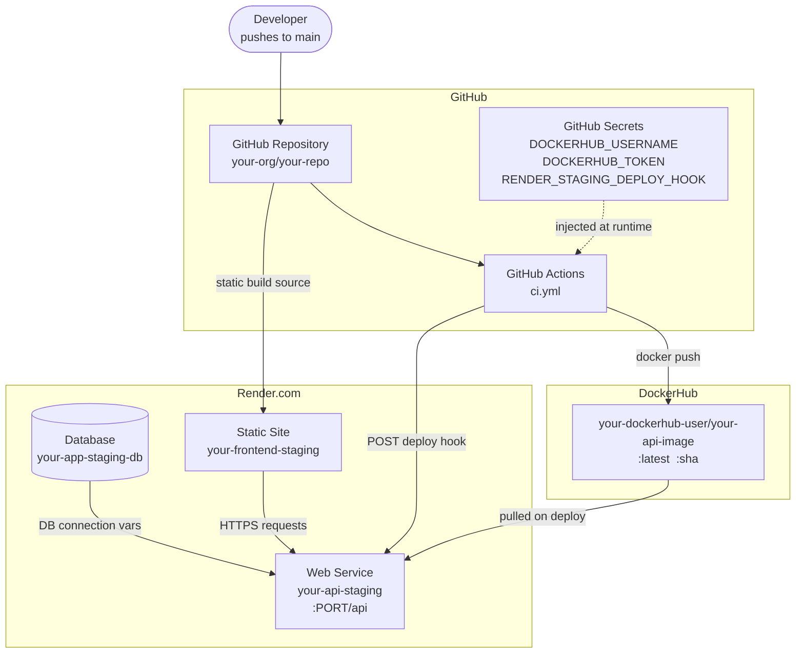
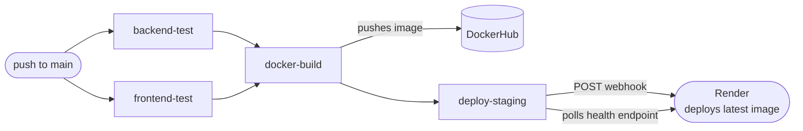

# Continuous Deployment with Render — Setup Guide

This guide explains how to deploy any project to [Render.com](https://render.com)
using GitHub Actions as the CD trigger. Every step includes *why* it is needed,
not just *how* to do it.

---

## Architecture Overview



### Component Descriptions

| Component | Role |
|---|---|
| **GitHub repo** | Single source of truth for all code and the pipeline definition |
| **GitHub Actions** | Runs tests, builds the Docker image, and triggers the Render deploy |
| **GitHub Secrets** | Stores credentials so they are never committed to the repo |
| **DockerHub** | Registry that hosts the versioned backend Docker image |
| **Render Database** | Managed database — Render handles backups, TLS, and connection pooling |
| **Render Web Service** | Runs the backend container pulled from DockerHub |
| **Render Static Site** | Hosts the built frontend (React/Vite, Next.js, etc.) via Render's global CDN |

---

## Pipeline Flow



**Why both test jobs must pass before `docker-build`:** If either test job fails,
`docker-build` is skipped automatically — and because `deploy-staging` depends on
`docker-build`, it is skipped too. This ensures broken code never reaches a live URL.

**Why `deploy-staging` depends on `docker-build`, not on the test jobs directly:**
If `deploy-staging` depended only on the test jobs, it could fire before the new
Docker image had been pushed to DockerHub. Depending on `docker-build` guarantees
Render always pulls the image built from this exact commit.

---

## Prerequisites

Before following the steps below, you need accounts on:

- [GitHub](https://github.com) — your code and pipeline live here
- [DockerHub](https://hub.docker.com) — stores the backend Docker image
- [Render](https://render.com) — hosts the database, backend API, and frontend

---

## Step 1 — Create the Database on Render

> **Why first:** The backend app reads database connection details at startup.
> If the database does not exist yet, the service will fail to connect and crash on boot.

1. Log in to [dashboard.render.com](https://dashboard.render.com)
2. Click **+ New → PostgreSQL** (or the database type your app uses)
3. Fill in:
   - **Name:** `<your-app>-staging-db`
   - **Database:** `<your_app>_staging`
   - **User:** `<your_app>_staging_user`
   - **Region:** choose the same region you will use for the Web Service (reduces latency)
   - **Plan:** Free (sufficient for demo/staging)
4. Click **Create Database**
5. Once created, copy these values — you will need them in Step 3:
   - **Internal Database URL** (used by Render services in the same region — routes over the private network, faster and free)
   - The individual **Host**, **Username**, **Password** fields

> **Internal URL vs External URL:**
> Use the **Internal** hostname for env vars on Render services (same region).
> Use the **External** URL to connect from your laptop (e.g., TablePlus, DBeaver).

---

## Step 2 — Create the Backend Web Service on Render

> **Why:** This is where your backend process runs. Render pulls the Docker image
> from DockerHub and runs it as a long-lived web process.

1. Click **+ New → Web Service**
2. Select **Deploy an existing image**
3. **Image URL:** `docker.io/<your-dockerhub-username>/<your-api-image>:latest`
4. Fill in:
   - **Name:** `<your-app>-api-staging`
   - **Region:** same as the database
   - **Instance Type:** Free
   - **Port:** the port your app listens on (e.g. `8080`)
5. Click **Create Web Service**

> The first deploy will likely fail until environment variables are set in Step 3 — that is expected.

---

## Step 3 — Set Environment Variables on the Backend Service

> **Why:** Your app reads all sensitive config from environment variables (never
> hard-coded). Render injects these at container startup.

In the Render dashboard → `<your-app>-api-staging` → **Environment** tab, add the variables your app needs. Common ones:

| Variable | Example value | Why |
|---|---|---|
| `DATABASE_URL` | internal connection string from Step 1 | Database connection |
| `DB_USER` | `<your_app>_staging_user` | Database username |
| `DB_PASSWORD` | `<password from Step 1>` | Database password |
| `JWT_SECRET` | any random 32+ character string | Signs and verifies JWT auth tokens |
| `PORT` | `8080` | Port your server binds to |
| `SPRING_PROFILES_ACTIVE` | `staging` | (Java/Spring) activates staging config |
| `NODE_ENV` | `production` | (Node.js) activates production mode |
| any other secrets your app needs | — | API keys, third-party service URLs, etc. |

> The exact variable names depend on your app. Check your app's config files or
> `README` for the full list of required env vars.

After saving, click **Manual Deploy → Deploy latest image** to trigger a fresh deploy.

---

## Step 4 — Get the Render Deploy Hook URL

> **Why:** A deploy hook is a unique HTTPS URL that, when POSTed to, tells Render
> to pull the latest Docker image and redeploy the service. This is how GitHub
> Actions triggers a deploy without needing SSH access or Render API credentials.

1. In Render dashboard → `<your-app>-api-staging` → **Settings** tab
2. Scroll to **Deploy Hook**
3. Click **Generate Deploy Hook**
4. Copy the full URL — it looks like:
   ```
   https://api.render.com/deploy/srv-xxxxxxxxxx?key=yyyyyyyyyyyyyyy
   ```
5. Keep this URL secret — anyone with it can trigger a deploy of your service.

---

## Step 5 — Store Secrets in GitHub

> **Why:** The pipeline needs credentials to push Docker images and to trigger
> the Render deploy hook. GitHub Secrets encrypts them at rest, keeps them out
> of logs, and prevents them from being committed to the repo.

1. Go to your GitHub repo → **Settings → Secrets and variables → Actions**
2. Click **New repository secret** for each of the following:

| Secret Name | Value | Used By |
|---|---|---|
| `DOCKERHUB_USERNAME` | Your DockerHub username | `docker-build` job — logs in to DockerHub |
| `DOCKERHUB_TOKEN` | DockerHub access token (**not** your password) | `docker-build` job — authenticates the push |
| `RENDER_STAGING_DEPLOY_HOOK` | The URL from Step 4 | `deploy-staging` job — triggers the Render redeploy |

> **Why a DockerHub Access Token, not your password?**
> Access tokens can be scoped (read-only, read+write) and revoked individually.
> If a token leaks, you revoke just that token without changing your password or
> affecting other services.

---

## Step 6 — Create the Frontend Static Site on Render

> **Why:** A static site (React/Vite, Next.js export, etc.) is served via Render's
> global CDN — no server process needed, which means zero cold start and lower cost.

1. Click **+ New → Static Site**
2. Connect your GitHub repo
3. Fill in:
   - **Name:** `<your-app>-frontend-staging`
   - **Branch:** `main`
   - **Root Directory:** `frontend` (or wherever your frontend code lives)
   - **Build Command:** `npm install && npm run build` (adjust for your framework)
   - **Publish Directory:** `dist` (or `build`, `.next/out`, etc. — check your framework)
4. Add any required build-time environment variables, for example:
   - `VITE_API_URL` = `https://<your-app>-api-staging.onrender.com/api`
   - `REACT_APP_API_URL` = same (for Create React App)
   - `NEXT_PUBLIC_API_URL` = same (for Next.js)
5. Click **Create Static Site**

> **Why set the API URL here, not hard-coded in source?**
> The bundler embeds env vars at build time into the JS bundle. Setting it in
> Render's dashboard means you can point the same frontend code at a different
> API URL (staging vs production) without changing source code.

---

## Step 7 — Add CORS Allowlist for the Frontend URL

> **Why:** Browsers block cross-origin requests by default. Your backend must
> explicitly allow the frontend's domain, otherwise every API call will be
> rejected with a CORS error before it reaches a controller.

Add the Render frontend URL to your backend's CORS configuration. For example:

**Spring Boot (`SecurityConfig.java`):**
```java
config.setAllowedOrigins(List.of(
    "http://localhost:5173",
    "http://localhost:3000",
    "https://<your-app>-frontend-staging.onrender.com"  // ← add this
));
```

**Express.js:**
```js
app.use(cors({
  origin: [
    'http://localhost:5173',
    'https://<your-app>-frontend-staging.onrender.com'
  ]
}));
```

Commit and push — this triggers the full pipeline and deploys the fix.

---

## Step 8 — Verify the Full Pipeline End-to-End

> **Why:** A pipeline that has never been exercised end-to-end may have silent
> failures. This step confirms every piece works together.

1. Make a trivial change (e.g., add a blank line to `README.md`)
2. Commit and push to `main`
3. Go to GitHub → **Actions** tab → watch the pipeline run
4. Confirm all jobs are green:
   - Backend test job ✅
   - Frontend test job ✅
   - Docker Build & Push ✅
   - Deploy → Staging ✅
5. Open `https://<your-app>-api-staging.onrender.com/<health-endpoint>` — should return a healthy response
6. Open `https://<your-app>-frontend-staging.onrender.com` — should show the app

---

## How the Health Check Works

The `deploy-staging` job does not just fire the webhook and assume success. It
actively polls your backend's health endpoint:

```yaml
- name: Wait for staging health check
  run: |
    for i in $(seq 1 18); do
      STATUS=$(curl -s -o /dev/null -w "%{http_code}" \
        https://<your-app>-api-staging.onrender.com/<health-endpoint>)
      if [ "$STATUS" -eq 200 ]; then
        echo "✅ Staging health check passed (attempt $i)"
        exit 0
      fi
      echo "Attempt $i/18 — HTTP $STATUS — retrying in 10s..."
      sleep 10
    done
    exit 1
```

- Polls every 10 seconds, up to 18 attempts (3 minutes total)
- Render free tier has a cold-start delay of 60–90 seconds — this loop absorbs it
- If the app never becomes healthy, the job fails with a clear error and the pipeline is marked red

Common health endpoint paths by framework:

| Framework | Health endpoint |
|---|---|
| Spring Boot + Actuator | `/api/actuator/health` |
| Express / Fastify | `/api/health` (add a simple `GET /health` route) |
| NestJS | `/api/health` (with `@nestjs/terminus`) |
| Django | `/api/health/` (custom view or `django-health-check`) |
| FastAPI | `/health` |

> **Interview talking point:**
> "The pipeline doesn't just trigger a deploy — it verifies the deployment
> succeeded by polling the health endpoint. If the new container doesn't come up
> healthy within 3 minutes, the GitHub Actions job fails and the team gets an
> immediate notification. This gives us confidence that every green pipeline run
> means live, working software."

---

## Secrets Reference

| Secret | Where stored | Used in |
|---|---|---|
| `DOCKERHUB_USERNAME` | GitHub Secrets | `docker-build` job |
| `DOCKERHUB_TOKEN` | GitHub Secrets | `docker-build` job |
| `RENDER_STAGING_DEPLOY_HOOK` | GitHub Secrets | `deploy-staging` job |
| `DATABASE_URL` / `DB_USER` / `DB_PASSWORD` | Render Environment | Backend app datasource |
| `JWT_SECRET` | Render Environment | Auth token signing |
| any other app secrets | Render Environment | App-specific needs |

No secret is ever committed to the repository. The `.gitignore` must exclude all
`.env` files and any files containing secrets.

---

## Common Errors and Fixes

| Error | Cause | Fix |
|---|---|---|
| App crashes on boot — can't connect to DB | Database URL env var not set on Render | Set the database connection env vars in Render Environment tab |
| `Invalid port number` in DB URL | URL contains embedded `user:pass@host` format (JDBC doesn't support this) | Put credentials in separate `DB_USER` / `DB_PASSWORD` vars; URL should contain only host and database name |
| `CORS error` in browser | Frontend domain not in backend CORS allowlist | Add the Render frontend URL to your CORS config and redeploy |
| Deploy hook returns 4xx | Hook URL is wrong or expired | Regenerate the hook in Render Settings |
| Health check times out | App crashed on startup | Check Render → your-api-staging → **Logs** for the startup error |
| First deploy fails immediately | Env vars not yet set | Set env vars in Render Environment tab, then trigger a manual redeploy |

---